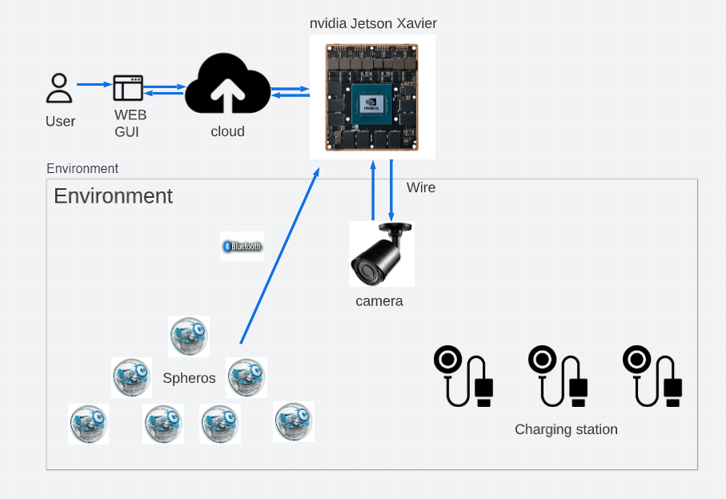

# **Hardware Platform with Artificial Intelligence Functionality**

### A Project By:

1. Janmejay Bhavsar
2. Jay Jatinkumar Patel
3. Rutvik Patel
4. Shailja Kartik
 
**Advisor:** Dr. Stas Tiomkin 


## **Project Architecture**




**Environment**

The Environment consists of multiple sensors including cameras and LiDars for the perception element. We plan to utilize computer vision to track the location of the Sphero robot. The gyro sensor gives the angle and rotation of the robot.

**Modules**

The whole system consists of the following modules.

- Cyber physical module
- Cloud module
- AI module
- Web module

## **Project Setup** 
Steps:
1) Clone the CyPhyAI repository from github and open it using VS Code
2) Download and Install Python 3.11 or latest
3) (If setting up the first time)In VS Code navigate to the View dropdown on the toolbar and select Command Palette
4) Search for Python: Create Environment and follow the prompts to create a new environment
3) Select the python interpretor to be python 3.11 in VS Code
4) Install following libraries using command: ```pip install bleak``` and ```pip install spherov2``` in the CyPhyAI folder
5) Replace sensor.py in .venv/lib/python3.11/site-packages/spherov2/commands with the file sensor.py in replace folder.
6) Replace sphero_edu.py in .venv/lib/python3.11/site-packages/spherov2/ with the file sphero_edu.py in replace folder.
7) Replace utils.py in .venv/lib/python3.11/site-packages/spherov2/ with the file utils.py in replace folder.
8) And then run the BoltTest.py file using the run button on the top right of VS Code
